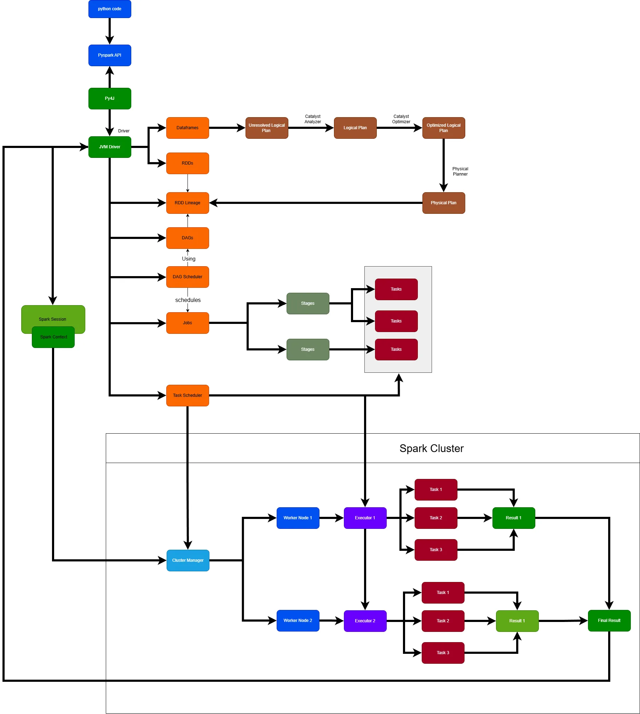

Spark Architecture:

Initially, Python code uses the PySpark API to communicate with the JVM Driver through Py4J. The SparkContext and SparkSession are created in the JVM, while Python holds proxy objects to interact with them.

In the first phase, the Driver creates an unresolved logical plan. The Catalyst Analyzer resolves it, the Catalyst Optimizer optimizes it, and the Physical Planner generates a physical execution plan. This physical plan is translated into RDD-based execution, forming RDD lineage, from which the Driver constructs a DAG.

In the second phase, actions trigger the creation of jobs. The DAG Scheduler schedules these jobs by splitting them into stages at shuffle boundaries. Each stage is divided into tasks, where each task processes a data partition.

In the third phase, the Driver requests executors from the Cluster Manager. The Cluster Manager allocates executors based on available resources. The Task Scheduler assigns tasks to executors, which execute them in parallel. Partial results are aggregated and returned to the Driver.

The Driver manages the Spark application, while the Cluster Manager manages the cluster infrastructure. A Spark cluster consists of multiple physical machines called worker nodes. Worker nodes host executors, and each executor has its own cores, memory, and storage.

Executor count can be configured statically or dynamically. If a worker or executor fails, the cluster manager detects the failure and the Driver re-executes the failed tasks on available executors using lineage-based fault tolerance.

